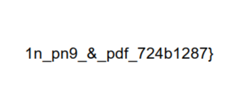
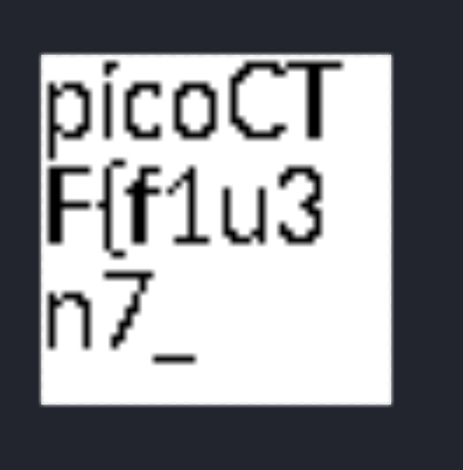

# Secret of the Polyglot

## Description
The Network Operations Center (NOC) of your local institution picked up a suspicious file, they're getting conflicting information on what type of file it is. They've brought you in as an external expert to examine the file. Can you extract all the information from this strange file?
Download the suspicious file [here](https://artifacts.picoctf.net/c_titan/97/flag2of2-final.pdf).

## inspection 
* openning the pdf we can find the 2nd half of the flag 



* for the first half of the flag we need to inspect the pdf deeper using [binwalk](https://github.com/ReFirmLabs/binwalk)
* install binwalk essetial libs `sudo apt install build-essential libfontconfig1-dev liblzma-dev`
* install cargo `sudo apt install cargo`
* install binwalk `cargo install binwalk`
* run binwalk on the pdf file 
```bash
binwalk ./Desktop/flag2of2-final.pdf

DECIMAL       HEXADECIMAL     DESCRIPTION
--------------------------------------------------------------------------------
0             0x0             PNG image, 50 x 50, 8-bit/color RGBA, non-interlaced
914           0x392           PDF document, version: "1.4"
1149          0x47D           Zlib compressed data, default compression
```

* the fild contains a PNG image starting from 0x0 to 0x914 (lets inspect this)
* extract the png to a file

```bash
dd if=./Desktop/flag2of2-final.pdf bs=1 count=914 of=extracted.png
```
* open the png



* we go the first part of the flag

 

